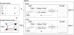

# Power maximization for floating offshore wind farms under partial operating conditions with RL

## Introduction
This repository contains the Python implementation of an RL-based floating offshore wind farm controller. The controller is based around a Markov decision process meant to capture the sequential process of choosing nacelle yaw misalignments for each turbine, ordered in-line with the direction of the freestream wind. Graph attention networks aid the actor and critic in the PPO agent, based on [CleanRL's PPO with continuous actions](https://github.com/vwxyzjn/cleanrl/blob/master/cleanrl/ppo_continuous_action.py).

The simulation tools used to model the floating offshore wind farm include [FLORIS](https://github.com/NatLabRockies/floris) and [MoorPy](https://github.com/NatLabRockies/MoorPy).

## Agent training
 + An agent which considers variable farm subsets may be trained using:\
    ``python gat_gaussian_ppo.py --save-model``
+ An agent that only ever sees the entire farm may be trained using:\
    ``python gat_gaussian_ppo.py --save-model --full-farm``

## GAT-based PPO Details
To make use of the graph representation of state, the actor and critic networks 
are augmented to include graph attention networks (GATs). Specifically, single-headed [GATv2Conv](https://pytorch-geometric.readthedocs.io/en/2.7.0/generated/torch_geometric.nn.conv.GATv2Conv.html)
style graph attention layers are used, effectively adding a graph-encoder to
the top of the PPO networks' forward calls. The figure below demonstrates the
general structure used. The code defining the PPO agent can be seen in the `GATAgent` class in `gat_gaussian_ppo.py`.

  

### Descriptions of the actor and critic
In the actor, the latent graph representation after the GAT graph-encoder is
passed through mean pooling to create a graph-summary vector. The mean-pooled
summary is concatenated with the current turbine's latent-graph feature vector
and the full original state vector, forming the input to the more standard
fully connected neural network (FCNN) actor architecture. The actor outputs a single 
mean action value, and the variance is left as a standalone learned parameter.

In the critic, the latent graph representation after the GAT graph-encoder is
passed through mean and max pooling to create two graph-summary vectors. Both
summary vectors are concatenated with the original state vector, again forming
the input to the more standard FCNN critic architecture.
The critic outputs a single value representing the estimated value of the state.

### Parameter values used
The actor and critic were constructed using:
| Parameter | Value | Description |
| :--- | :---: | :---: |
| Actor GAT layers | 2 | # of GAT layers in the actor graph-encoder |
| Actor GAT hidden dim. | 64 | Size of latent vectors in actor graph-encoder |
| Actor GAT residual | True | Whether or not residual connections are used |
| Critic GAT layers | 2 | # of GAT layers in the critic graph-encoder |
| Critic GAT hidden dim. | 64 | Size of latent vectors in critic graph-encoder |
| Critic GAT residual | True | Whether or not residual connections are used |
| Actor FCNN layers | 3 | # of layers in FC portion of actor network |
| Actor FCNN hidden dim. | 64 | Size of latent vectors in actor FCNN |
| Critic FCNN layers | 3 | # of layers in FC portion of critic network |
| Critic FCNN hidden dim. | 64 | Size of latent vectors in critic FCNN |

The reward function utilized (after a light grid search):
| Parameter | Value | Description |
| :--- | :---: | :---: |
|$\lambda_1$ | $1/200$ | Actuation penalty |
|$\lambda_2$ | $1$ | Improvement over greedy |
|$\lambda_3$ | $1/3$ | Performance of baseline greedy |

The general PPO parameters are mostly the same as the CleanRL PPO defaults. 
Values can be found in the defaults set for the arguments in `Args` class in
`gat_gaussian_ppo.py`.